# oOnline-Document

> Claw学习前端的笔记

<hr><br>


# HTML

## h 标签

```html
<!-- h1 h2 h3... -->
<h1>h标签</h1>
```


## p 标签

```html
<p>p标签</p>
```


## a 标签

> target默认为当前窗口跳转 可以设置为"_blank"使其重新打开新的链接页面

```html
<a href="链接地址" target=""></a>
```


## img 标签

```html

```


## base标签

> base应该写在head之内

```html
<base target="_blank">
```


## 转义字符

|    代码    |  含义  |
| :--------: | :----: |
| &amp;nbsp; |  空格  |
|  &amp;lt;  |   <    |
|  &amp;gt;  |   >    |
| &amp;yen;  | &yen;  |
| &amp;copy; | &copy; |
| &amp;reg;  | &reg;  |


## 文本格式化标签

> b i s u 是基础的表现形式strong em del ins的语义更强烈 两者都可以实现相同的效果

```html
<b></b> | <strong></strong> 粗体
<i></i> | <em></em> 斜体
<s></s> | <del></del> 删除线
<u></u> | <ins></ins> 下划线
```


## 注释标签

```html
<!-- 注释不会显示在浏览器窗口中，但是可以在网页源代码上看到 -->
```


## 列表

### 无序列表

```html
<ul>
    <li>A</li>
    <li>B</li>
    <li>C</li>
</ul>
```

### 有序列表

```html
<ol>
    <li>A</li>
    <li>B</li>
    <li>C</li>
</ol>
```

### 自定义列表

```html
<dl>
    <dt>题目1</dt>
    <dd>选项1</dd>
    <dd>选项2</dd>
    ...
    <dt>题目2</dt>
    <dd>选项1</dd>
</dl>
```


## div标签（盒子）

```html
<div>
    <h1></h1>
    <p></p>
</div>
```


## span标签

> span标签无语义，通常用来组合行内元素

```html
<p><span></span>text</p>
```

<hr><br>


# CSS (Cascading Style Sheets)

> CSS可以对前端的样式以及位置进行调整


## 行内式（内联样式）

```html
<标签 style="属性:属性值;">content</标签>
<h1 style="color:red;">红色的h1</h1>
```


## 内部样式

> 将CSS代码写在head标签中使用，type="text/css"在HTML5中可以省略

```html
<head>
    <style type="text/css">
        选择器 {
            属性1: 属性值1;
            属性2: 属性值2;
        }
    </style>
</head>
```


## 外部样式

> 使用link标签将外部样式文件链接到当前HTML文档中，同样也要写在head标签中

```html
<head>
    <link href"CSS文件地址/路径" rel="stylesheet">
</head>
```


<hr><br>


## CSS选择器

### 类选择器

类选择器使用 “ **.** ”（英文点）表示，后跟类名格式如下

```css
.类名 {
    属性: 属性值;
    ...
}
```

同时类名选择器可以选择多个

```html
<div class="bor-top bor-c-red">content</div>
```


### id选择器

> id选择器用 “#” 表示， 后接id名，和类选择器不同的是id只能标识一个不可以重复，但是类可以

```css
#id名 {
   属性: 属性值;
   ...
}
```


### 通配符选择器

> 用 “ ***** ” 号表示，作用范围是最广的，可以选择到页面中的所有元素

```css
* {
    属性: 属性值;
    ...
}
```


<hr><br>


## CSS字体样式属性

> **px** 以像素单位
>
> **em** 根据当前对象内的文本大小的尺寸（例：当前对象内字体大小为18px，则1em=18px）

### font-style 字体风格样式

字体倾斜除了用 **i** 和 **em** 标签之外的CSS实现方法

> **italic** 和 **oblique** 都是使字体倾斜，但是有些字体不支持 **italic** 的

```css
.style-demo {
    font-style: normal(默认值) | italic | oblique;
}
```

### font-wight 字体粗细

字体粗细除了用 **b** 和 **strong** 之外的CSS实现方法

> **400 **等价于 **normal** | **700 **等价于 **bold**

```css
.style-demo {
    font-size: normal|bold|bolder|lighter|100 ~ 900 (100的整倍数);
}
```

### font-size 字体大小

```css
.style-demo {
	font-size: px|em;
}
```

### font-family 字体

```css
.style-demo{
    font-family: "微软雅黑";
}
```

### font 字体综合设置

> 属性之间用 **空格** 隔开

```css
.style-demo {
    font: font-style font-weight font-size font-family;
}
```

<hr><br>


## CSS 基本外观属性

### color 文本颜色

rgb模式可以使用 **(0, 0, 0)** 或者 **(0%, 0%, 0%)** 使用百分比表示时不可以省略 **%** 号

rgba模式可以设置透明度数值在 **0 ~ 1** 之间

```css
.style-demo {
    color: red | rgb(0, 0, 0) | rgba(0, 0, 0, 0~1);
}
```

### line-height 行间距

> 行距比字号大 7~8 像素就可以

```css
.style-demo {
    line-height: px|em|%;
}
```

### text-align 水平对齐方式

```css
.style-demo {
    text-align: left|right|center;
}
```

### text-indent 首行缩进

> 可以用负数 建议使用em (2em = 首行缩进2字符)

```css
.style-demo {
    text-indent: 2em;
}
```

### text-decoration

用来修改链接效果

> none 默认样式
>
> underline文本下
>
> overline 文本上
>
> line-through 穿过文本

```css
.style-demo {
    text-decoration: none|underline|overline|line-through
}
```


<hr><br>


## 块级元素

块级元素会独占一行（多行），可以设置它的宽高以及对齐等属性，特点：

> 1. 总是从新的一行开始
> 2. 高度、宽度、内外边距都可以控制
> 3. 宽度默认是100%
> 4. 可以容纳其他行内元素（内联元素）、块元素


## 行内元素

行内元素不会自身不会占独立的空间，它的空间大小是根据自己字体的大小和图像尺寸支撑结构的，所以一般来说不用设置宽高和对齐等属性。

```
常见行内元素：
	<a> <strong> <b> <em> <i> <del> <s> <ins> <u> <span>...
```

> **行内元素特点：**
>
> 1. 和相邻的内联元素在同一行上
> 2. 宽高无效，但是水平方向的内外边距（padding和margin）可以设置，垂直方向的无效
> 3. 默认宽度就是内容的宽度
> 4. 行内元素只能容纳文本和其他内联元素（a是特殊）
>
> **PS：**只有文字才能组成段落，p标签里不能放块级元素，相同的还有h1~h6、dt，他们都是文字类的块级标签，里面不能放其他块级元素。
>
> 行内元素中有几个特殊的标签  <input> <td> 这几个标签可以设置宽高。


## 行内块

行内块同时具备行内元素和块元素的特点

> 1. 和相邻的行内块元素在同一行上，但是它们之间会有空隙
> 2. 默认宽和行内元素一样就是内容的宽度
> 3. 宽高、行高、内外边距都可以设置


## 标签模式转换

```css
display: inline; 转为行内元素

display: block; 转换为块元素

display: inline-block; 转换为行内块元素
```


<hr><br>


## 盒子模型

> CSS分三大板块：盒子模型、浮动、定位加上别的一些细节
>
> 盒子模型就是将整个HTML页面看作一个盒子，所有的文档标签都会有一个元素矩形框（element box），每个矩形框都由元素的内容、内边距（padding）和外边距（margin）组成。


### width 宽度	height 高度

> 只有块元素（block）或者行内块（inline-block）元素才能设置宽高。

```css
width: 100px;
height: 100px;
```


### 边框 border

`border-top border-bottom border-left border-right 同理`

```css
border: border-width border-style border-color;
```

`border-style (边框样式)可以设置为不同样式的边框`

```css
none: 没有边框，忽略宽度(默认值)
solid: 单实线边框
dashed: 虚线边框
dotted: 点线边框
double: 双实线边框
```


### 内边距 (padding)

`padding-top padding-bottom padding-right padding-left`

```css
padding: 3px; 上下左右都是3px
padding: 3px 6px; 上下3px 左右6px
padding: 3px 6px 9px; 上3px 左右6px 下9px
padding: 3px 6px 5px 4px; 上3px 右6px 下5px 左4px
```


### 外边距 (margin)

> margin 属性值位置和 padding 一样

`margin-top margin-bottom margin-left margin-right`


### 外边距实现盒子居中

> 让一个盒子水平居中元素必须是块元素而且指定了宽高

```css
/* 盒子(块元素)水平居中 */
width: 256px;
margin: 0 auto;

/* 文字水平居中 */
text-align: center;
```


### 清除元素默认内外边距

> 行内元素只有左右内外边距，没有上下内外边距，在IE6等低版本浏览器会有问题。
>
> 所以尽量不要给行内元素指定内外边距。

```css
padding: 0;
margin: 0;
```


### 外边距合并问题

使用margin定义块元素的上下外边距时，可能会出现外边距的合并。

如果有两个元素，一个在上面设置了外边距 margin-bottom，一个在下面设置了外边距 margin-top，则他们之间的垂直边距不是，margin-bottom与margin-top之和，而是值较大的一方，这种现象称为相邻块元素垂直外边距的合并 **外边距塌陷**

**解决方案：**

1. 设置父元素的上边框或者内边距为1像素
2. 给父类添加 **overflow:hideen**


### 内容宽高

使用属性 width 和 height 可以控制盒子的大小

符合CSS规范的盒子模型总宽高计算原则是：

元素空间尺寸

```css
空间高度 = content height + padding + border + margin
空间宽度 = content width + padding + border + margin
```

元素实际大小

```css
实际高度 = content height + padding + border + margin
实际宽度 = content width + padding + border + margin
```

1. 大部分浏览器Firefox、Edge、Chrome和IE6以上的版本都采用W3C规范
2. 宽高属性只能用于块级元素，对行内元素无效 (img、input标签除外)
3. 在计算总高度的同时，应该考虑上面说的外边距塌陷的情况
4. 一个盒子（块元素）占满父元素的宽度，如果盒子没有指定宽度，则padding不会影响改盒子的大小


### 盒子模型布局稳定性

稳定性排行：

```
width > padding > margin
```

1. margin 可能会出现外边距合并（塌陷），IE6以下的 margin 会加倍（bug）
2. padding 会影响盒子的大小，需要进行加减计算，稍微有点麻烦


### 怪异盒子模型

```css
box-sizing: border-box; /* 怪异盒子模型 */
box-sizing: content-box; /* 标准盒子模型 */
```

> 怪异盒子模型的宽高计算和标准盒子模型的计算方式不同，怪异盒子模型的  content 内容宽度会把 padding 和 border 算入其中，由外向内的计算宽度


### 两种盒子的区别

`主要区别在于盒子的宽高计算方式不同`

1. 标准盒子模型（正常）主要用于 PC 端，怪异盒子模型主要用于手机端
2. 标准盒子模型的大小是由内向外的，由内部决定外部大小，而怪异盒子模型是由外向内的
3. 可以设置 box-sizing 属性来使用这一特性，使其改变border宽度也不影响其它元素

<hr><br>


## 盒子模型知识点补充

### 高度：

> 图片标签设置了宽度之后，可以将高度设置为 auto (自动) 实现等比例自动计算

### 同行宽度：

> 一行内多个元素的占位宽度 (margin + border + padding + width) 相加大于容器宽度就会被挤到下一行显示

### 内外边距：

> 1. 外边距垂直会合并，值为最大的那一边 | 水平方向会叠加
> 2. 如果父容器没有边界（硬性边界、边框、内边距）就会产生穿透效果 子元素的外边距会穿透父元素生效
> 3. 内外边距都只能设置为整数

### 行高与高度：

> 当行高跟高度相等时，文本会垂直居中


<hr><br>


## CSS背景 (background)

| 代码                                                  | 作用             |
| :---------------------------------------------------- | ---------------- |
| background-color                                      | 背景颜色         |
| background-image                                      | 背景图片地址     |
| background-repeat                                     | 是否平铺         |
| background-position                                   | 背景位置         |
| background-attachment                                 | 背景固定 \| 滚动 |
| background-size                                       | 背景大小（尺寸） |
| background: color url repeat attachment position/size | 背景综合写法     |


### 背景颜色 (color)

> CSS3背景透明使用 rgba(0, 0, 0, 0.3) 第四个参数在 0~1 之间
>
> 透明属性的设置只会影响背景，不会影响元素内容

```css
background-color: hex(16进制) | rgb | rgba;
```


### 背景图片 (image)

> 使用绝对或者相对地址指定背景图片
>
> background-image只允许一张图片展示在背景中，只有CSS3才可以多背景，可以和background-color配合使用，图片不能覆盖的地方会显示填充的颜色，如果平铺图片则会覆盖背景图片
>
> 建议图片地址不加引号

```css
background-image: none | url(url)
```


### 背景平铺 (repeat)

| 参数      | 含义               |
| --------- | ------------------ |
| repeat    | 图片平铺（默认值） |
| no-repeat | 图片不平铺         |
| repeat-x  | 图片横向平铺       |
| repeat-y  | 图片纵向平铺       |


```css
background-repeat: repeat | no-repeat | repeate-x | repeat-y;
```


### 图片位置 (position)

> x y 坐标默认时(0% 0%) 如果只指定了一个值默认是 x 坐标
>
> position 大多用于背景图片的居中对齐

```css
background-position: length-x | length-y;
background-position: position-x | position-y;
```

position参数: top | center| bottom | left | right


### 背景附着 (attachment)

```css
background-attachment: scroll | fixed;
```

`scroll 滚动	fixed 固定`


### 背景大小（尺寸）

> 单位 px | % | cover
>
> 只设置 width 时 height 会等比例缩放

```css
background-size: width height;
```


### 背景裁剪 (clip)

| 参数        | 含义                     |
| ----------- | ------------------------ |
| content-box | 将图片裁剪和内容大小一致 |
| border-box  | 将图片裁剪至边框位置     |
| padding-box | 将图片裁剪至内边距位置   |


```css
background-clip: content-box | border-box |padding-box;
```

设置图片原点位置 (origin)

> 用来设置背景图片起始位置
>
> 属性值和 **clip** 一样

<hr><br>


## CSS复合选择器

### 交集选择器

```html
<!-- CSS -->
<style>
    p.one {
        color: red;
    }
</style>

<!-- HTML -->
<p>A</p>
<p class="one">A</p>
```

`带有 one 类的 p 标签文本变为红色，第一个 p 标签不受影响`


### 并集选择器

不同选择器之间通过 <b style="color: orange">, 逗号</b> 连接

```css
.one,
.two,
.three {
    color: orange;
}
```

```html
<!-- HTML -->
<h1 class="one">橘色标签1</h1>
<h1 class="two">橘色标签2</h1>
<h1 class="three">橘色标签3</h1>
```

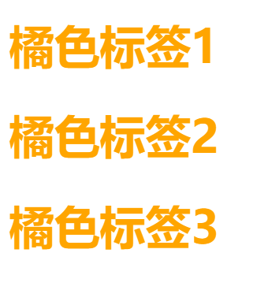</img>

<hr><br>


### 后代选择器

后代选择器又称为包含选择器

```css
/* CSS */
div ul li {
        color: green;
    }
```

```html
<!-- HTML -->
<div>
    <h1>title</h1>
	<ul>
        <li>list-1</li>
        <li>list-2</li>
    </ul>
</div>
```

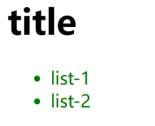</img>

<hr><br>


### 子代选择器

只能选择该元素的子代元素，子代优先级高于后代，使用时优先选择使用子代选择器

```css
/* CSS */
.style-demo > h1 {
    color: green;
}
```

```html
<!-- HTML -->
<div>
	<h1>测试样例-1</h1>
</div>
    
<div class="style-demo">
	<h1>测试样例-2</h1>
</div>
```

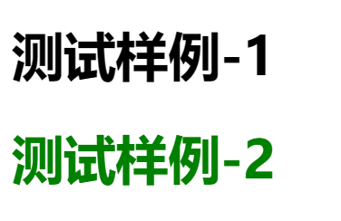</img>

<hr><br>


### 伪类选择器

> <b style="color:orange;">类选择器 .</b>	**.style**
>
> <b style="color:orange;">伪类选择器 :</b>	**:link**
>
> 写链接伪类时注意顺序：
>
> 1. :link
> 2. :visited
> 3. :hover
> 4. :active

**链接伪类选择器**

| 伪类     | 作用                 |
| -------- | -------------------- |
| :link    | 未访问的链接         |
| :visited | 已访问的链接         |
| :hover   | 鼠标移动到连接链接上 |
| :active  | 已经点击访问过的链接 |

**一个简单的例子：**

```css
a {
    font-size: 24px;
    color: black;
}

/* 鼠标滑过字体会变为28px 而且颜色会变为天蓝色
   当鼠标移开时会变回初始样式  
*/
a:hover {
    font-size: 28px;
    color: skyblue;
}
```

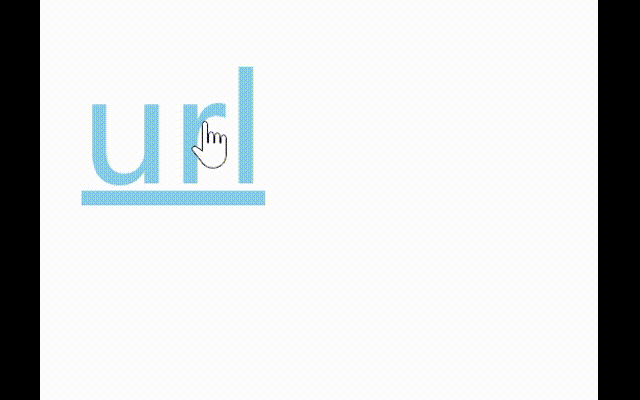</img>


<hr><br>


## CSS 特性

<b style="color:orange;">叠层 继承 优先级</b> 是CSS必须掌握的三个特性


### CSS 层叠性

举一个简单的例子 :chestnut: 当我们已经写好了一个样式，样式设置原色颜色为蓝色，字体大小为16px，但是接下来我们需要一个新的样式，它和刚才那个样式一样，但是它比前面的那个样式多了一个边框设置并且字体大小为24px，这个时候我们除了重新写一篇一模一样的并加上新规则还可以使用CSS的一特性 <b style="color:orange;">叠层性</b>

`如果重复的话，谁在最底层就会是谁	CSS样式优先级 内联样式 > 内部样式 > 外联样式`

```css
/* CSS */
.style-base {
    color: blue;
    font-size: 16px;
}

.style-border {
    font-size: 24px;
    border: 1px solid black;
}
```

```html
<!-- HTML -->
<span class="style-base style-border">content</span>
```

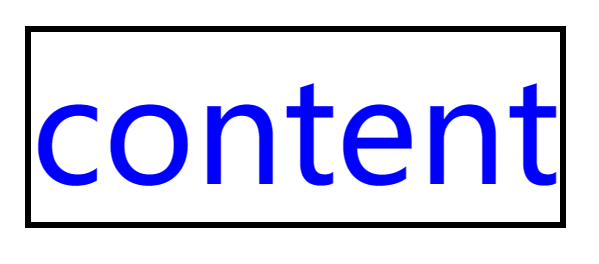</img>

<hr><br>


### CSS继承性

再举一个简单的例子 (我有很多:chestnut:) 我们写了一个 **div** 的CSS样式设置字体颜色为green，我们在div标签中写入其他内容会发现其他字体内容也是绿色，这就是继承性。

> 常见的继承属性：开头是 **font- text- line-** 以及 **color** 都可以继承
>
> 自身有默认样式的情况下优先显示，也就是继承性优先级最低。

```css
div {
    color: green;
}

.bg-black {
    background: black;
}
```

```html
<div>
    <h3 class="bg-black">我是div标签里的h3</h3>
</div>
```

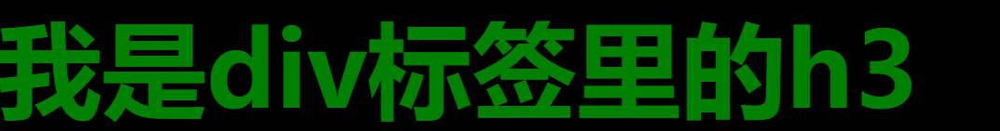</img>

<hr><br>


### CSS 优先级

权重越大优先级越高

- 继承样式权重为0
- 行内样式优先级最高，权重非常高
- 权重相同时 CSS 会选择最排在最后的样式
- CSS 有一个 **!important** 命令，该命令被赋予最大的优先级，不管权重大小以及位置的前后，**!important** 都拥有最大的优先级


### CSS特殊性（Specificity）

CSS的权重有一个计算公式，称为 CSS 特性或者 非凡性，是一个衡量 CSS 值优先级的一个标准

值从左往右，越往左权重越大，数位之间没有进制

| 元素/样式        | 权重值  |
| ---------------- | ------- |
| 继承 / *         | 0,0,0,0 |
| 每个元素（标签） | 0,0,0,1 |
| 每个类 / 伪类    | 0,0,1,0 |
| 每个ID           | 0,1,0,0 |
| 每个行内样式     | 1,0,0,0 |
| 每个 !important  | **∞**   |

权重是可以叠加的，比如下面的例子：

```
div a img : 0,0,0,3
.bg a img : 0,0,1,2
a:hover   : 0,0,1,1
#only p   : 0,1,0,1
```

<hr><br>


## vertical-align

设置垂直对齐方式

vertical-align 不会影响到块级元素的内容对齐，他只针对行内元素或行内块元素，通常用来控制 <b style="color: skyblue;">图片 </b>或者 <b style="color:skyblue;">表单 </b>与文字之间的对齐方式

```css
vertical-align: baseline(默认) | top | middle | [bottom sub];
```

`baseline 对齐基线、top 对齐顶线、middle 对齐中线、bottom \ sub 对齐底线`

> 图片的在块元素中以基线对齐的方式 (vertical-align: baseline) 底部会有一点空隙，可以将 **img标签** 的**vertical-align**设置为**除了baseline**以外的其他属性值，最好的就解决方法就是将图片标签设置为块元素 <b style="color:greenyellow;">block</b>

| 属性值                             | 效果图                                                       |
| ---------------------------------- | ------------------------------------------------------------ |
| vertical-align: baseline; 对齐基线 | 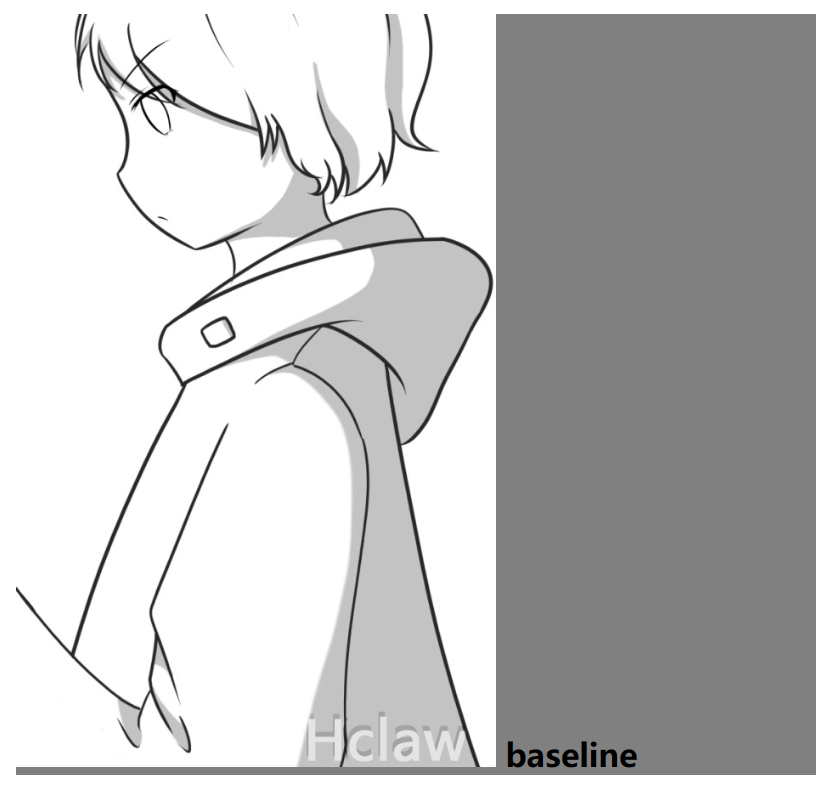 |
| vertical-align: middle; 对齐中线   | 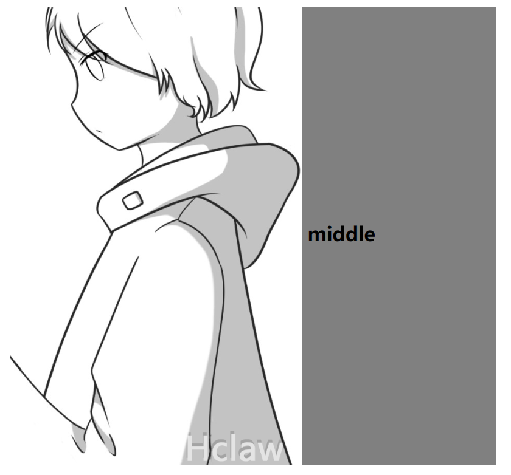 |
| vertical-align: top; 对齐顶线      | 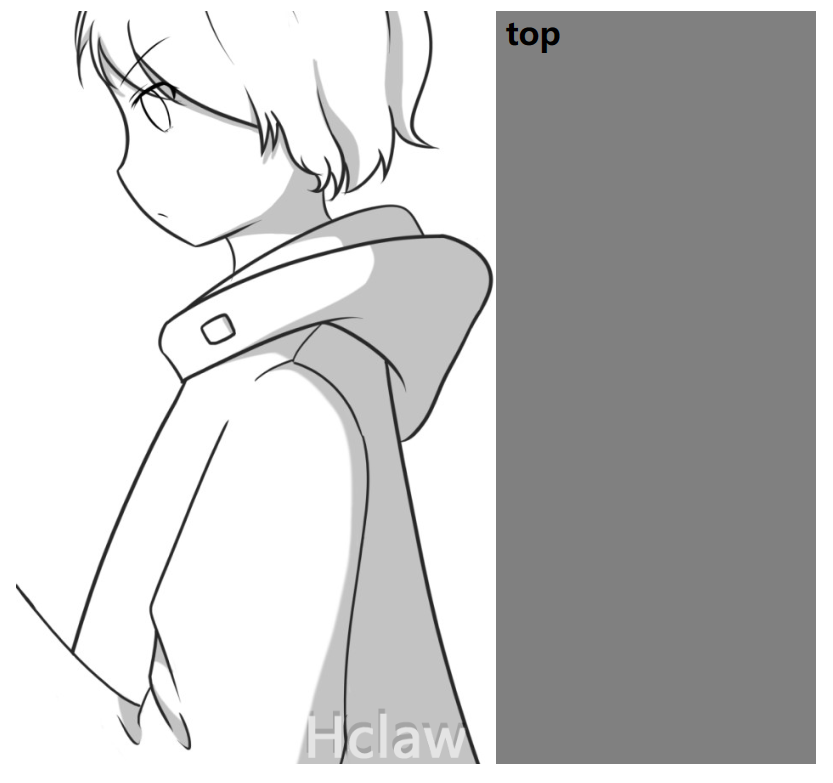  |
| vertical-align: bottom; 对齐底线   | 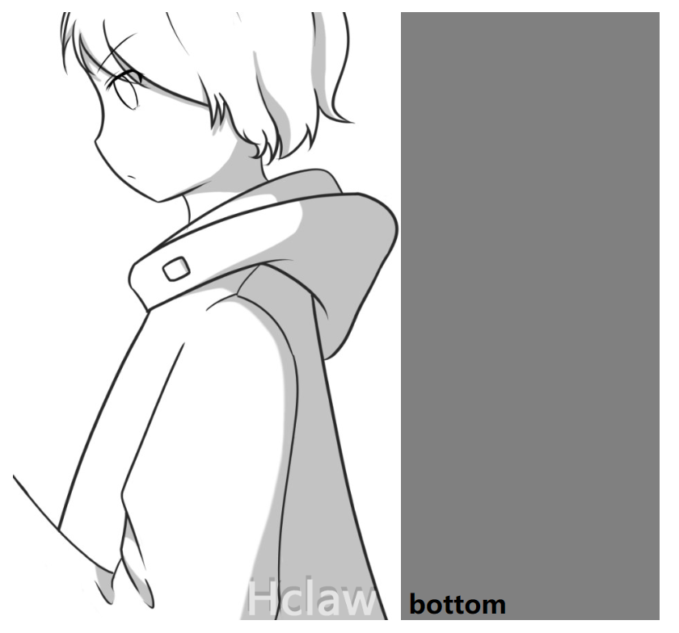 |

<hr>
<br>


## 溢出文字隐藏

### white-space（自动换行）

```css
white-space: normal(默认值) | pre | nowrap | pre-wrap | pre-line | inherit;
```

| 属性值   | 描述                                                     |
| -------- | -------------------------------------------------------- |
| normal   | **默认值** 空白位置会被浏览器忽略                        |
| pre      | 浏览器会保留空白位置 这种行为类似于 **pre** 标签         |
| nowrap   | 文本不会换行，会一直在同一行上显示，直到遇到 **br** 标签 |
| pre-wrap | 保留空白的序列，会正常的换行                             |
| pre-line | 合并空白的序列，保留换行符                               |
| inherit  | 从父元素继承 **white-space** 属性                        |

<hr>

### text-overflow（文字溢出）

```css
text-overflow: clip | cllipsis | string;
```

| 属性值   | 描述                             |
| -------- | -------------------------------- |
| clip     | 裁剪文本                         |
| ellipsis | 使用省略号来表示被裁剪的文本     |
| string   | 使用指定的字符来表示被裁剪的文本 |

### 多行文本超出隐藏设定

> 使用此方法需要注意高度和宽度的设置

```
display: -webkit-box;	/* -webkit-inline-box; 行内元素 */
-webkit-box-orient: vertical;	/* 单词vertical释义: 垂直 */
-webkit-line-clamp: 3;	/* 设定在第几行结束后显示 ... */
overflow: hidden;	/* 单词hidden释义: 隐藏的 */
```


<hr><br>

## opacity (透明)


> **opacity** 单词释义 **不透明度**
>
> 属性值范围在 0 ~ 1 之间

```css
opacity: (0~1) | inherit;
```

`在IE8以及以下的浏览器中 使用不透明度需要写为 filter(过滤器)`

```css
filter: Alpha(opacity=(0~100));
```


<hr><br>
## 复合选择器

指定选择器后的第一个选择器：<b style="color:orange;">element-1 + element-2</b>

指定选择器后的所有的 **element-2**：<b style="color:orange;">element-1 ~ element-2</b>

> 复合选择器只对同一层的元素生效

```css
.wrap+h2 {
    color: red;	/* 设置wrap类后面的第一个h2为红色字体 */
}
```

```html
<h1 class="wrap">我是wrap</h1>
<h2>h2-1</h2>
<h2>h2-2</h2>
<h2>h2-3</h2>
```

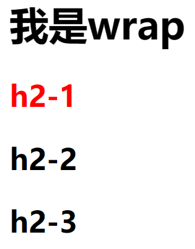</img>

```css
.wrap~h2 {
    color:red;	/* 设置wrap类后面所有的h2为红色字体 */
}
```

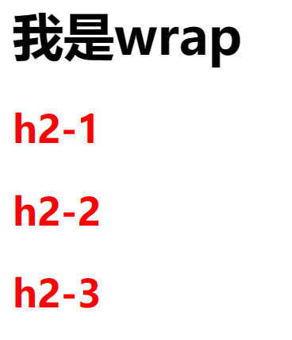</img>

<hr><br>

## 结构伪类选择器 (CSS3)

> **:first-child**	匹配该元素的父元素下的的第一个子元素
>
> **:last-child**	匹配该元素的父元素下的最后一个元素
>
> **:nth-child(n)**	匹配所选元素的父元素下的第 n 个元素
>
> **:nth-last-child(n)**	匹配所选元素的父元素下的第 n 个子元素的每个元素
>
> **:nth-of-type(n)**	匹配所选元素的父元素下同类型中的第 n 个兄弟元素
>
> **:first-of-type**	匹配同类型中的第一个兄弟元素
>
> **:last-of-type**	匹配同类型中的最后一个兄弟元素
>
> **:only-of-type**	匹配同类型中的父元素下唯一的一个元素
>
> **:not(selection)**	匹配所选元素的父元素下除了 selection(选择器) 的所有元素 
>
> *上面的选择器中带 **(n)** 的都可以使用公式或者 **odd奇数 even偶数***

```css
/* 选择p标签父元素下的第一个元素 */
p:first-child {
    style: value;
}

/* 选择p标签父元素下的最后一个元素 */
p:last-child {
    style: value;
}

/* 选择p标签父元素下的第二个元素如果元素不是p则无法，因为虽然选中了但因为不是p标签所以无法生效 */
p:nth-chile(2) {
    style: value;
}

/* 选择p标签父元素下同类型的第二个元素 */
p:nth-of-type(3) {
    style: value;
}

/* 选择p标签父元素下同类型的第一个元素 */
p:first-of-type {
    style: value;
}

/* 选择p标签父元素下同类型的第一个元素 */
p:last-of-type {
    style: value;
}

/* 选择只有一个子元素的父元素容器 并且这个唯一的子元素是p */
p:only-of-type {
    style: value;
}

p:not(.wrap) {
    /* 选择p标签父元素下同类型除了带.wrap的p的所有p */
    style: value;
}
```


<hr><br>
## 属性选择器

> **^**	在开始位置
>
> **$**	在结束位置
>
> *****	在任意位置

```css
/* 选择div标签以 border 类开头的div元素 */
div[class^="border"] {
    color: red;
}

/* 选择div标签以 end id结尾的div元素 */
div[id$="end"] {
    color:red;
}

/* 选择div标签类名中任意位置有 font 的div元素 */
div[class$="font"] {
    color:red;
}
```


<hr><br>


## 伪元素 (CSS3)

> ::first-letter	文本中的第一个字或者字母
>
> ::first-line	文本中的第一行
>
> ::selection	改变文本选中时的样式
>
> ::before	最前面的
>
> ::after	最后面的
>
> 伪元素不是真正的元素，但是可以显示在页面上，同样也可以对伪元素设置CSS样式
>
> 默认display:inline;	::before和::after 必须配合content使用否则无效

`IE9以下不支持::的写法，如果考虑兼容性可以写为 : 不用强制写为::`

<hr><br>
## 精灵技术

> 用户访问一个网站的时候每张图片都要见过一次请求才能返回给用户使用精灵技术可以很好的解决这个问题，CSS精灵是一种处理网页背景图像的方法，它可以将很多零散的的小图标这类的图片合并到一张图片中，对图片使用 position 定位来使用精灵图。

```css
bg-top {
	width: 20px;
	height: 20px;
	background: url(path) no-repeat -10px -10px;
}
```

### 制作精灵图

可以自己做也可以有更好的方法：<a href="https://www.toptal.com/developers/css/sprite-generator/" style="text-decoration:none;">[ 精灵图制作网站 ]</a>

<hr><br>


# 其他技巧

## 清除列表默认样式

```css
list-style: none;
```

